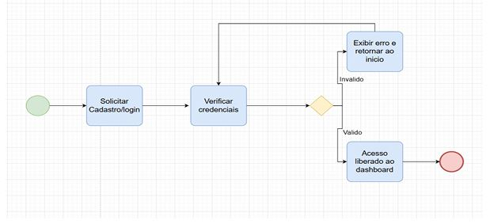
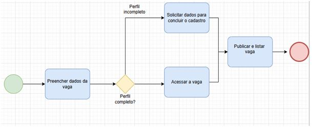
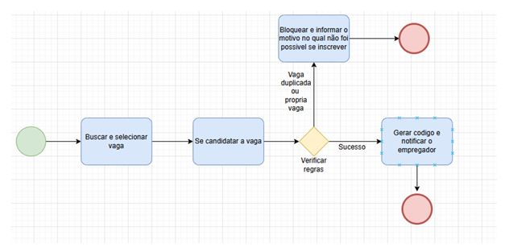

## **Mapeamento de Processos do Sistema Karteria** 

## **1. Processo de Gestão de Acesso (Cadastro e Login)** 

Este processo descreve o fluxo de entrada do usuário na plataforma 
Karteria. 

## **2. Processo de Criação de Vaga (Empregador)** 

Este processo detalha como o empregador disponibiliza uma nova oportunidade. 

## **3. Processo de Candidatura (Colaborador)** 

Este processo descreve o fluxo de aplicação para uma vaga. 

